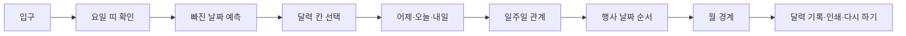

# 달력 순서 복원소 전체 리디자인 계획

- 작성일: 2026-08-30 (KST)
- 대상: `/Volumes/ External Drive 256G/Dev2/codex/calendar-sequence-repair-shop`
- 요청 모드: `full` 리디자인
- 현재 상태: **코드 구현 완료 · 로컬 검증 통과 · 브라우저 검증은 환경 제한으로 보류**
- 변경 경계: 계획 문서 작성 시점에는 코드·설정·이미지 자산을 수정하지 않았으며, 이후 별도 구현 단계에서 승인 범위만 수정함

## 0. 사전 확인 결과

### 프로젝트 규칙과 현재 상태

- 프로젝트 루트와 상위 경로에서 `AGENTS.md`, `EDUCATION_DESIGN.md`, `design-system/MASTER.md`를 찾지 못했다.
- 대신 기존 제품 계약은 `README.md`, `docs/plans/2026-08-28-calendar-sequence-repair-shop-implementation-plan.md`, `docs/content-review.md`, `docs/image-rights-ledger.md`, `docs/qa/acceptance-checklist.md`에 기록되어 있다.
- 프레임워크: Vite + React 19 + TypeScript. Next.js 앱은 아니다.
- 패키지 매니저: npm (`package-lock.json`).
- 핵심 명령: `dev`, `build`, `lint`, `typecheck`, `test:run`, `test:a11y`, `test:e2e`, `check:lines`, `verify`.
- 현재 브랜치: `main`; 기준 커밋: `d819783 docs: record calendar-sequence-repair-shop release evidence`.
- 시작 시 `git status --short --untracked-files=all`은 출력이 없었다.

### 필수 하위 Skill 게이트

확인 시점: 2026-08-30 (KST), 현재 Codex 런타임의 Skills 목록과 실제 문서 로드 결과 기준.

| 역할 | 런타임 상태 | 실제 확인 경로 | 이번 단계 상태 |
|---|---|---|---|
| `$education-webapp-redesign` | available | `/Users/kimhongnyeon/.codex/skills/education-webapp-redesign/SKILL.md` | 로드 완료 |
| `$impeccable` | available | `/Users/kimhongnyeon/.codex/skills/impeccable/SKILL.md` | 로드 완료; 초기 정적 감사에 사용 |
| `$ui-ux-pro-max` | available via user-provided skill | `/Users/kimhongnyeon/.agents/skills/ui-ux-pro-max/SKILL.md`를 실제로 읽고 CLI 검색 실행 | 설계 시스템 산출 완료 |
| `$redesign-existing-projects` | available | `/Users/kimhongnyeon/.codex/skills/redesign-existing-projects/SKILL.md` | 로드 완료; 구현은 보류 |
| `$imagegen` | available | `/Users/kimhongnyeon/.codex/skills/imagegen/SKILL.md` | 로드 완료; 생성은 보류 |
| Asset safety reference | available | `/Users/kimhongnyeon/.codex/skills/education-webapp-redesign/references/asset-safety.md` | 로드 완료 |

사용자가 정확한 `$ui-ux-pro-max` Skill 문서와 경로를 제공했고, 2026-08-30에 실제 문서를 읽고 검색 CLI를 실행했다. 따라서 사전 게이트를 해소하고 생성된 시스템을 프로젝트 규칙에 맞게 조정한 뒤 구현 단계로 이동한다.

## 1. 목표와 보존할 제품 진실

### 목표

초등 1~2학년 학습자가 첫 화면에서 “달력의 빠진 순서를 근거로 복원한다”는 일을 바로 이해하고, 시작 → 활동 → 피드백 → 기록 → 다음 행동의 흐름을 덜 망설이며 끝까지 따라가도록 전체 화면의 시각 위계와 조작 경험을 재설계한다.

### 반드시 보존

- 2026년 9월 고정 미션 6개, 날짜·요일·월 경계의 승인된 판정과 오개념 방지 문구
- `src/domain/calendarMath.ts`의 UTC 기반 날짜 계산과 `src/app/sessionReducer.ts`의 상태 전이·수정 기회 계약
- 점수·속도·등급·순위 없음, 이름·개인정보 입력 없음, 서버·저장소·외부 요청 없음
- 마우스·터치·키보드 동등 조작, 320px 이상 흐름, 200% 확대, 축소 모션, 인쇄 가능한 결과
- 라이트 모드 고정, 학생용 VoiceOver·TTS·내레이션·음성 녹음 미추가
- `업데이트 내역` 진입점과 실제 변경 이력

## 2. 현재 학습자 흐름



상태 전이와 데이터 모델은 유지하고, 각 상태에서 다음 세 가지가 한 번에 읽히도록 화면을 재배치한다.

1. 지금 해결할 질문
2. 달력에서 살펴볼 근거
3. 현재 가능한 다음 행동과 그 결과

## 3. 리디자인 범위

### 핵심 화면

- `src/features/calendar-repair/EntranceScreen.tsx`: 입구의 학습 목표, 6개 미션 요약, 시작 CTA
- `src/features/calendar-repair/CalendarWorkbench.tsx`: 미션 헤더, 단계 카드, 피드백, 뒤로 가기
- `src/features/calendar-repair/stages/*.tsx`: 요일 띠, 빈칸 예측, 칸 선택, 관계 카드, 일주일, 행사 순서, 월 경계
- `src/features/calendar-repair/CalendarGrid.tsx`: 7열 달력과 320px 읽기 목록의 시각·상태 표현
- `src/features/calendar-repair/FeedbackPanel.tsx`: 정답·재시도·기록 상태의 위계와 다음 CTA
- `src/features/report/LearningReport.tsx`: 6개 기록을 최초 판단·근거·수정 결과 순서로 읽는 결과 화면

### 공통 껍데기와 접근성

- `src/app/App.tsx`: 건너뛰기 링크, 단계 제목·콘텐츠 영역, 단계 전환 뒤 초점/스크롤 위치
- `src/components/ProgressSteps.tsx`: 현재 단계가 한눈에 보이는 진행 표시
- `src/components/ActionButton.tsx`: 기본·hover·active·focus·disabled 상태와 단계별 CTA 강조
- `src/components/ModalDialog.tsx`: 업데이트/다시 하기 모달의 라벨, 초점 이동·복귀, Tab 경계
- `src/components/UpdateHistoryButton.tsx`, `src/accessibility/AccessibilityToolbar.tsx`: 보조 도구를 학습 흐름을 방해하지 않는 위치로 정리

### 스타일과 설계 문서 후보

- `src/styles/tokens.css`: 색상, 서체, 간격, 반경, 표면, 상태, z-index 토큰
- `src/styles/app.css`: 앱 프레임, 헤더, 공통 버튼·모달·결과 레이아웃
- `src/features/calendar-repair/workbench.css`: 단계·달력·선택·피드백 전용 스타일
- `src/styles/motion.css`: 필수 CTA의 `gi-pulse`와 `prefers-reduced-motion` 정적 대체
- 실제로 `src/styles/components.css`, `src/styles/surfaces.css`를 추가해 공통 도구·모달·결과 표면을 분리
- `design-system/MASTER.md`: `$ui-ux-pro-max`가 가용해진 뒤 기존 스타일을 대체하는 승인 가능한 토큰·패턴 문서로 작성

화면 구성은 현재 파일 책임을 우선 유지하며, 새 컴포넌트가 필요할 때만 기능 단위로 추가한다. 모든 TS·TSX·CSS 파일은 500줄 미만으로 유지한다.

## 4. 디자인 방향 결정 경계

`$ui-ux-pro-max` 검색 결과를 다음처럼 조정하여 프로젝트 디자인 시스템을 확정했다. 전체 기록은 `design-system/MASTER.md`에 있다.

- 대상: 초등 1~2학년, 한국어 읽기 수준, 교실 또는 가정의 짧은 개별 연습
- 핵심 은유: 실제 숫자·요일을 HTML 달력으로 직접 조작하며 고치는 작업대
- 표현 원칙: 밝은 라이트 모드, 큰 숫자, 충분한 칸 크기, 한 화면 한 우선 행동, 차분한 단일 강조색
- 금지: 장식이 학습 근거를 가리는 구성, 색만으로 정답/오답 전달, 과도한 카드·필·그라디언트, 사실처럼 보이는 생성 이미지의 숫자·문자·로고
- 상태: 기본·hover·active·focus-visible·disabled·선택·오답 안내·정답·수정 결과·완료
- 반응형: 320/375/768/1280px 및 200% 글자 확대에서 세로 흐름과 CTA 우선순위 보장

검색 결과의 외부 Google Fonts와 GSAP는 오프라인·무서버 계약과 새 의존성 금지 때문에 채택하지 않고, 로컬 한국어 서체 스택과 CSS motion으로 대체했다.
검색 결과의 일반적인 Feature-Rich Showcase 패턴은 현재 작업형 학습 흐름과 맞지 않아 사용하지 않고, 달력 중심 단일 작업대 패턴으로 조정했다.

## 5. 상태별 구현 계약

| 상태 | 학생이 먼저 읽을 것 | 주요 조작 | 완료 뒤 보여 줄 것 |
|---|---|---|---|
| `INTRO` | 무엇을 복원하는지와 시작 방법 | `달력 복원 시작하기` | 요일 띠 단계 |
| `WEEKDAY_STRIP` | 일요일부터 토요일 순서 | 요일 버튼 7개 | 확인 CTA와 순서 근거 |
| `PREDICT` | 빈칸의 날짜·요일 | 날짜와 요일 선택 | 예상 문장, 제출 CTA |
| `SELECT` | 같은 요일 두 칸 | 달력 칸 2개 | 선택 수, 7일 근거, 확인 CTA |
| `RELATE` | 오늘 기준 어제·내일 | 두 관계 선택 | 두 날짜의 근거, 완성 CTA |
| `WEEK` | 7일 뒤 또는 날짜 순서 | 칸/행사 카드 선택 | 순서와 날짜 근거, 완성 CTA |
| `BOUNDARY` | 9월 30일 다음 달 | 날짜·요일 선택 | 10월 1일 근거, 완성 CTA |
| `REPORT` | 오늘의 복원 기록 | 인쇄 또는 처음부터 | 다음 연습 행동을 선택할 수 있는 결과 |

응답 제출 후 새 단계가 아닌 같은 단계에 피드백이 나타나는 경우에도 피드백 제목 또는 첫 행동으로 초점을 옮기고, 좁은 화면에서 그 영역이 보이도록 스크롤한다. 오답 첫 시도에서는 정답을 즉시 노출하지 않고 근거 확인과 한 번의 수정 기회를 유지한다.

## 6. 자산 판정 계획

- 먼저 `public`, `src/assets`, JSX/TSX import, CSS `url()`, `srcset`, preload를 다시 검색한다.
- `src/assets/generated/friendly-paper-calendar.svg`는 입구의 장식 자산이다. 실제 달력의 정답·숫자·요일을 전달하지 않으므로 이미지 생성 교체 없이 보존 후보로 둔다.
- `public/favicon.svg`는 브랜드/식별 자산이므로 자동 생성·교체하지 않는다.
- 새 장식·개념 이미지가 정말 필요할 때만 `$imagegen`과 `asset-safety.md`를 적용하고, 원본을 보존한 `-v2` 파일과 `work/education-webapp-redesign-assets.md` 기록을 함께 만든다.
- 실제 달력 숫자·요일·격자, 데이터·도식·로고는 이미지로 만들지 않는다.

## 7. TDD 및 검증 순서

구현 단계에서는 다음 순서로 실행했다.

1. 기존 컴포넌트 테스트를 기준으로 새 구조의 역할·라벨·CTA·상태 텍스트 테스트를 먼저 보강한다.
2. 모달 초점 경계, 건너뛰기 링크, 단계 전환 뒤 초점/스크롤, `aria-pressed`, reduced motion 회귀 테스트를 추가한다.
3. `$ui-ux-pro-max` 승인 토큰을 `design-system/MASTER.md`와 `src/styles/tokens.css`에 반영한다.
4. `$redesign-existing-projects` 지침에 따라 기존 상태·콘텐츠·라우팅을 보존한 채 프레임 → 공통 컴포넌트 → 학습 단계 → 결과 화면 순으로 구현한다.
5. 자산 감사를 다시 수행하고 기존 장식 SVG가 충분해 `$imagegen`은 호출하지 않았다.
6. 명령이 실제 `package.json`에 존재하는지 확인하며 다음을 실행한다.

```text
npm run lint
npm run typecheck
npm run test:run
npm run test:a11y
npm run check:lines
npm run build
npm run test:e2e
node /Users/kimhongnyeon/.codex/skills/impeccable/scripts/detect.mjs --json <changed markup targets>
```

7. 브라우저 CLI를 별도 포트에서 세 차례 시도했으나 npm/Playwright 캐시 권한 오류로 실행하지 못했다. 따라서 1280×800, 768×1024, 375×812, 320×568와 200% 확대의 실제 브라우저 확인은 후속 수동 게이트로 남긴다.

## 8. 수용 기준

- 첫 화면에서 학습 목적과 시작 CTA가 첫 시선에 읽힌다.
- 각 단계에서 “지금 할 일 → 근거 → 다음 행동”이 한 번에 구분된다.
- 모든 필수 CTA에는 필요한 단계에만 `gi-pulse`가 적용되고, reduced motion에서는 고정 외곽선/`필수` 배지로 바뀐다.
- 달력·선택 상태가 색 외에도 텍스트, 아이콘/기호, 테두리, `aria-pressed`로 구분된다.
- `:focus-visible`, 건너뛰기 링크, 논리적 Tab 순서, 모달 Tab 경계, 단계/피드백 초점 이동이 동작한다.
- 320/375/768/1280px 및 200% 확대에서 가로 스크롤 없이 학습 흐름을 끝낸다.
- `prefers-color-scheme: dark`를 추가하지 않고 라이트 모드를 유지한다.
- 학생 대상 음성 기능, 저장, 네트워크, 이름/개인정보 입력을 추가하지 않는다.
- 업데이트 내역에 2026-08-30의 실제 리디자인 변경 기록을 추가했다.
- lint, typecheck, 단위/a11y 테스트, 줄 수, build, detector 결과를 각각 독립된 증거로 남겼다. E2E·실제 브라우저 시각 검증은 환경 제한으로 보류했으며 VoiceOver는 검증 범위에서 제외한다.

## 9. 위험과 롤백

| 위험 | 예방 | 롤백 |
|---|---|---|
| 디자인 변경이 날짜 판정/상태를 흔듦 | domain/reducer 파일을 기본 비변경 영역으로 두고 기존 테스트를 먼저 실행 | 리디자인 변경분만 되돌리고 기존 컴포넌트 참조 복원 |
| 7열 달력이 좁은 화면에서 읽히지 않음 | 320px 목록 전환 유지, 375/200% 확대 실제 확인 | 기존 목록 브레이크포인트와 레이아웃으로 복원 |
| 모션이 학습 행동을 가림 | 필수 CTA에만 사용, reduced-motion 회귀 테스트 | `gi-pulse` 클래스 제거 및 정적 강조 복원 |
| 새 자산이 사실·출처처럼 보임 | asset-safety 분류와 버전 파일·장부 기록 | 새 참조를 원본 장식 또는 자산 없음으로 되돌림 |
| CSS/컴포넌트 파일이 500줄을 넘음 | 구현 중 `npm run check:lines`, 기능별 분리 | 마지막 안전한 분할 상태로 되돌림 |

## 10. 재개 조건

디자인 시스템과 코드 리디자인이 완료되었다. 이 문서와 `work/education-webapp-redesign-audit.md`, `design-system/MASTER.md`를 구현·검증 근거로 보존한다. 커밋·푸시·배포·HVC 등록은 별도 출시 승인 전까지 하지 않는다.

2026-08-30에 사용자가 커밋·푸시·배포를 별도로 승인하여 `main`에 반영하고 GitHub Pages 공개 URL을 확인했다. HVC 등록은 실행하지 않았다.

## 11. 구현 완료 기록

- `App.tsx`: skip link와 `main#main-content`를 추가하고 헤더/입구 구조를 정리했다.
- `ModalDialog.tsx`: `aria-labelledby`, Tab/Shift+Tab 순환, Escape, 호출 초점 복귀를 구현했다.
- `FeedbackPanel.tsx`: 제출 결과가 생길 때 피드백 제목으로 초점을 옮기도록 했다.
- `EntranceScreen.tsx`, `CalendarWorkbench.tsx`: 입구·준비 단계·미션 작업대를 새 정보 위계로 재구성했다.
- `src/styles/tokens.css`, `components.css`, `app.css`, `surfaces.css`, `workbench.css`, `motion.css`: 로컬 서체 스택, 인디고/오렌지/노랑 의미색, 320px 대응, reduced-motion을 반영했다.
- 새 단위 회귀 테스트: `src/components/ModalDialog.test.tsx`, skip link 및 피드백 제목 초점 검증.
